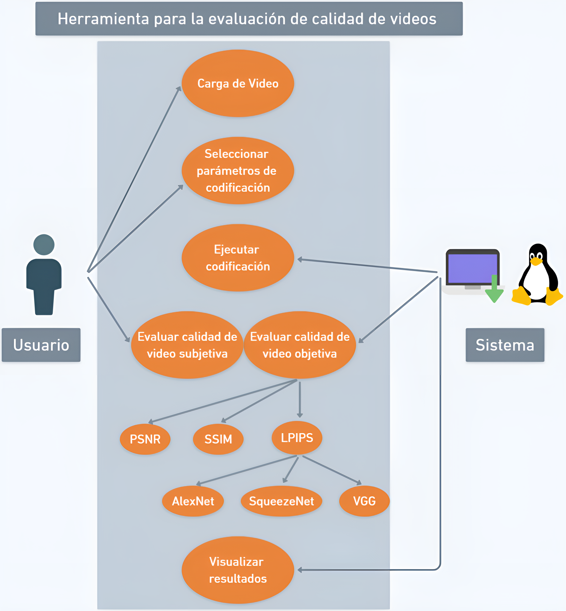

Esta herramienta, desarrollada en Python y evaluada en Ubuntu 22.04, permite evaluar la calidad de video utilizando diferentes métricas, incluyendo LPIPS, PSNR y SSIM. Además, se proporciona un AppImage para su uso sin necesidad de descargar el repositorio.

## Software y Librerías Necesarias

Para ejecutar la aplicación, necesitas instalar las siguientes librerías y software:

### FFMPEG
sudo apt update
sudo apt install ffmpeg

### PYTHON3 y PIP3
sudo apt install python3 python3-pip

### OPENCV
pip3 install opencv-python

### TORCH
pip3 install torch torchvision

### LPIPS
pip3 install lpips

### Instalar Pillow
pip3 install Pillow

### Instalar FUSE
sudo apt-get install fuse libfuse2

### Instalar Matplotlib
pip3 install matplotlib

### Instalar skimage
pip3 install scikit-image

### Instalar tkinter
sudo apt-get install python3-tk

### FontAwesome (Opcional)

Se recomienda descargar la carpeta de FontAwesome propuesto en el link de AppImage y reemplazarla en el sistema, aunque no es necesaria para el funcionamiento de la aplicación.

## Caso de Uso

## Link de descarga para el AppImage
Si decides descargar la aplicación, es necesario otorgar permisos de ejecución con el siguiente comando:
chmod +x tu-aplicacion.appimage
[Descargar AppImage](https://drive.google.com/drive/folders/1HFhPmYnEkK0fhuUNFArt_ds1-IkDWuob?usp=sharing)
